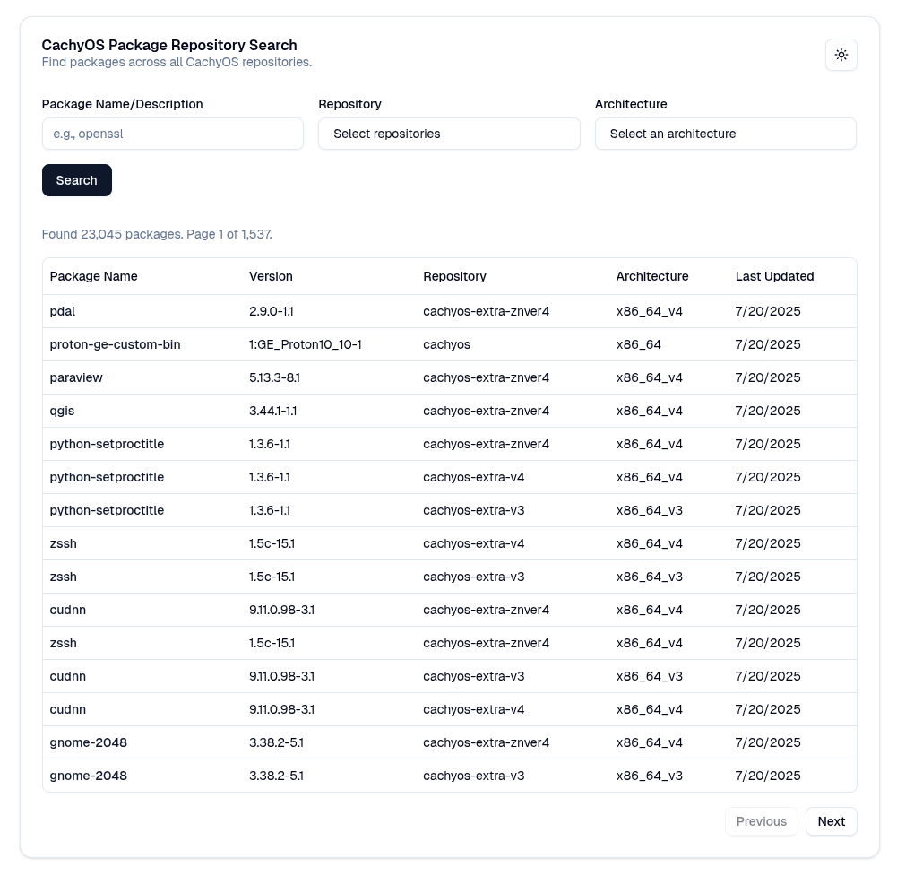

# CachyOS Repository Dashboard

<div align="center">
    <a href="example.png">
        <picture>
            <source media="(prefers-color-scheme: dark)" srcset="example-dark.png">
            <source media="(prefers-color-scheme: light)" srcset="example-light.png">
            
        </picture>
    </a>
</div>

The web dashboard for the CachyOS repositories provides a user-friendly interface to search and view packages.

### Prerequisites

- [Node.js](https://nodejs.org/) (v20 or later)
- [Bun](https://bun.sh/) (v1.2 or later)

### Installation

1.  Clone the repository:

    ```bash
    git clone https://github.com/cachyos/public-dashboard.git
    cd public-dashboard
    ```

2.  Install the dependencies:

    ```bash
    bun --bun install
    ```

3.  Start the development server:
    ```bash
    bun --bun run dev
    ```

The application will be available at [http://localhost:3000](http://localhost:3000).

### Building for Production

To create a production-ready build, run the following command:

```bash
bun --bun run build
```

This will create an optimized build in the `.dist` directory. To run the production server, use:

```bash
bun server.mjs
```

### Environment Variables

#### Server

- `PORT`: Port the production server listens on (default: `3000`). Read by `server.mjs`.
- `HOSTNAME`: Host interface the production server binds to (default: `0.0.0.0`). Read by `server.mjs`.
- `VITE_APP_VERSION`: Injected into the dashboard `<meta>` tag. Typically set at build time via `--build-arg` or `VITE_APP_VERSION=$(git rev-parse --short HEAD)`.

#### API URL

- `VITE_ENDPOINT_URL`: API endpoint URL (default: `http://localhost:5862/api`).
- `NEXT_PUBLIC_ENDPOINT_URL`: Legacy fallback for `VITE_ENDPOINT_URL`. Prefer the former.

#### GitHub

- `GITHUB_TOKEN`: Optional GitHub PAT used by the server when fetching the mirrorlist and PKGBUILD tree.

#### Redis Cache

- `CACHE`: Set to `redis` to enable Redis caching. Any other value (or unset) keeps the in-memory LRU as the sole cache layer.
- `REDIS_URL`: Redis Sentinel URL (default: `http://localhost:6379`). Only the hostname is used as the Sentinel host.
- `REDIS_MASTER_NAME`: Sentinel master group name (default: `shard_master0`).
- `REDIS_PASSWORD`: Redis auth password (default: `1234`).
- `REDIS_SENTINEL_PASSWORD`: Sentinel auth password (default: `1234`).
- `CACHE_PREFILL_PATH`: Optional absolute path to the prefill JSON the server auto-seeds on startup. Defaults to `dist/cache-prefill.json` resolved from the module or CWD.

NB: The cache in-process LRU (L1, up to 500 entries) plus Redis (L2). When `CACHE` is unset or not `redis`, only L1 is used.

#### Build / Debug

- `BUILD_PHASE`: Set to `1` during the build-time prefill step to skip Redis entirely (no connection attempt, no auto-seeding from an existing prefill). The `build` npm script sets this automatically — you only need it if running `scripts/prefill-cache.ts` manually.
- `SWR_DEBUG`: Set to `1` to log every cache lifecycle event (`hit-fresh`, `hit-stale`, `expired`, `miss`, `fetch-start/ok/err`, `set-mem`, `set-redis`, `seed`, `dedupe`, etc.). Alternatively, set `DEBUG` to a value containing `swr` (e.g. `DEBUG=swr`).

## Building and Running with Docker

You can also build and run the web dashboard using Docker.

### Build the Docker Image

To build the Docker image, run the following command from the root directory:

```bash
docker build -t public-repo-dashboard .
```

An optional `--build-arg VITE_APP_VERSION=$(git rev-parse --short HEAD)` can be used to include the current Git commit in the dashboard's `<meta>` tag during the build.

### Run the Docker Container

To run the Docker container, use the following command:

```bash
docker run -p 3000:3000 public-repo-dashboard
```

The application will be available at [http://localhost:3000](http://localhost:3000).

